# Instalación del entorno de desarrollo — Raylib + Visual Studio Code (Windows)

## Requisitos previos

Antes de comenzar, necesitaremos instalar las herramientas necesarias para programar videojuegos en C++ usando Raylib.

Software necesario:

- Visual Studio Code
- Compilador C/C++ (MinGW mediante MSYS2)
- Raylib
- Extensiones de C++ para VS Code

---

# Paso 1 — Instalar Visual Studio Code

Descargar e instalar Visual Studio Code desde:

https://code.visualstudio.com/

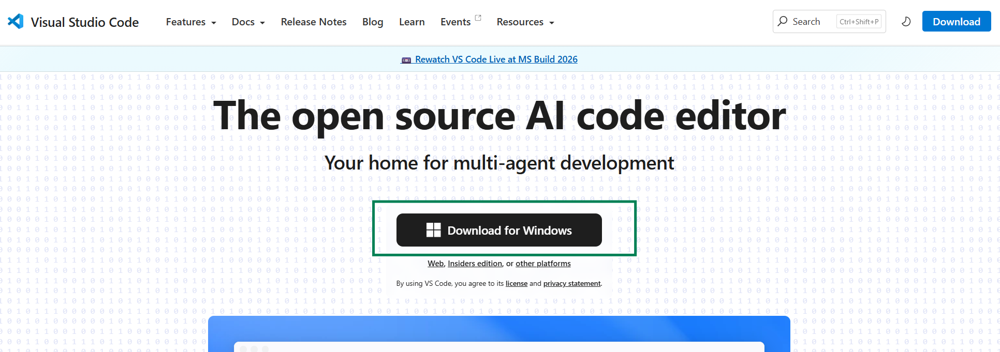

Durante la instalación, se recomienda marcar:

- Add to PATH
- Register Code as editor
- Add "Open with Code"

## Comprobar instalación:

1. Para abrir un terminal PowerShell, pulsamos la tecla de Windows (o pulsamos en inicio) y escribimos power.

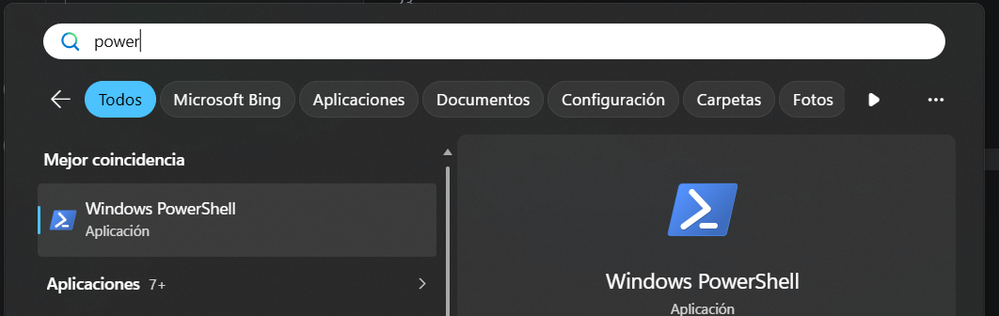

2. escribiendo esto en la terminal: 

```powerShell
code
```

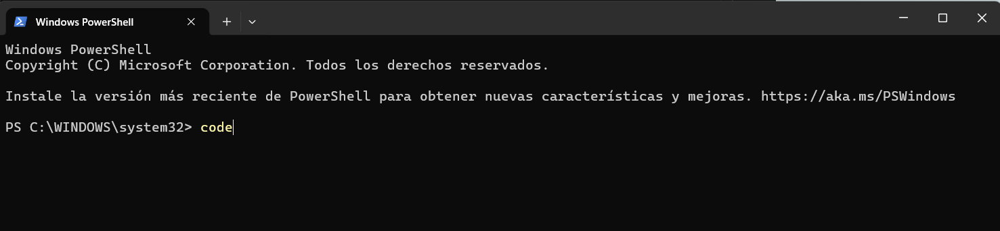

3. Si está instalado, se abrirá el programa Visual Studio Code.

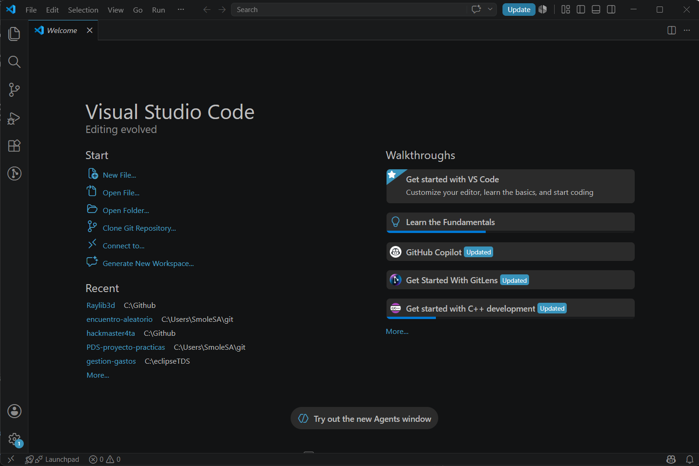
---

# Paso 2 — Instalar MSYS2

MSYS2 nos permitirá instalar el compilador de C++.

Descargar desde:

https://github.com/msys2/msys2-installer/releases/download/2026-06-11/msys2-x86_64-20260611.exe

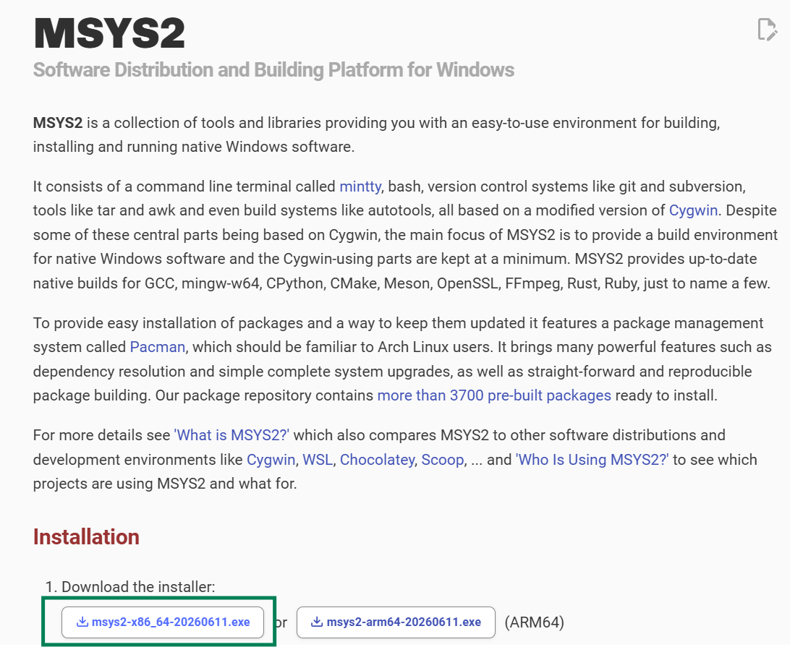

Instalar en la ruta por defecto:

```text
C:\msys64
```

---

# Paso 3 — Actualizar MSYS2 MINGW64

**Abrir**:

Para abrir MSYS2 MINGW64, pulsamos la tecla de Windows (o pulsamos en inicio) y escribimos "MSYS2 MINGW64".

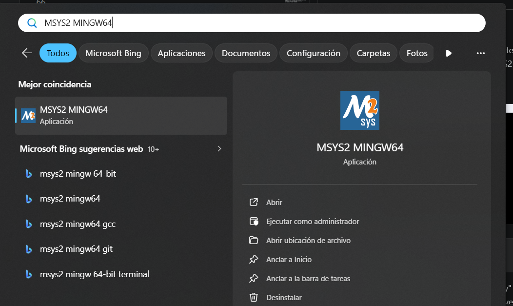


**Ejecutar**:

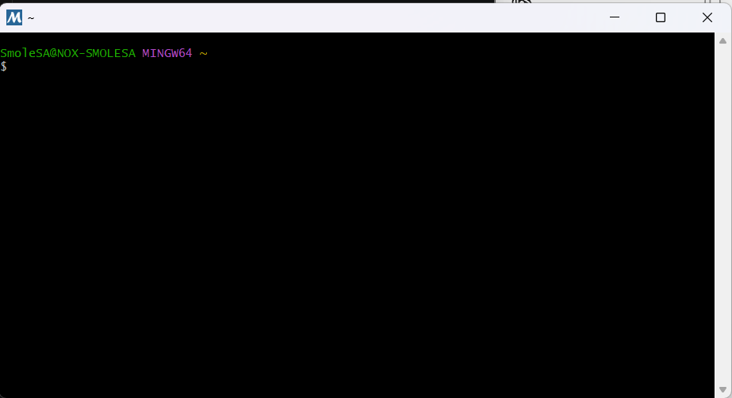

```bash
pacman -Syu
```

Puede pedir confirmaciones, escribimos "y" y pulsamos enter. Puede pedir cerrar la terminal y volver a abrirla.

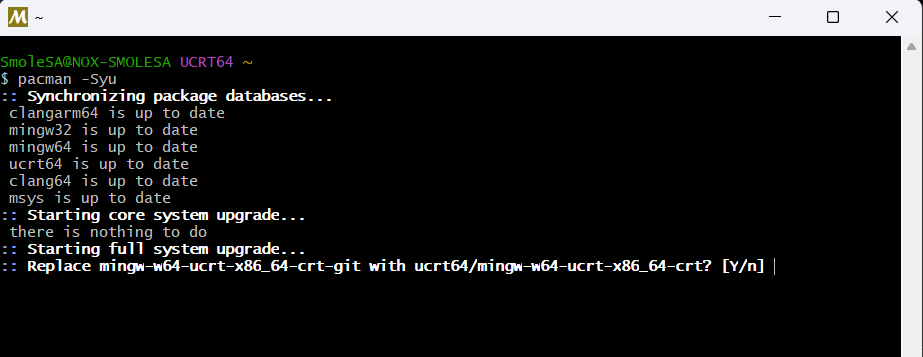

Después ejecutar nuevamente:

```bash
pacman -Syu
```

hasta que no queden actualizaciones pendientes.

---

# Paso 4 — Instalar compilador C++, make y Raylib

En la terminal **MSYS2 MINGW64** ejecutar:

```bash
pacman -S mingw-w64-x86_64-toolchain
pacman -S make
pacman -S mingw-w64-x86_64-raylib
```

Esto instala:

- g++
- gcc
- linker
- herramientas de compilación
- Makefile
- Raylib

## Comprobar instalación :

```bash id="m2"
g++ --version
make --version
pkg-config --modversion raylib
```
devería aparecer algo como esto:

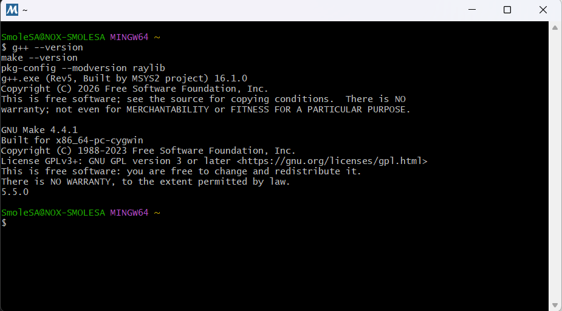

---

# Paso 5 — Añadir compilador al PATH (opcional pero recomendado)

Añadir al PATH del sistema:

```text
C:\msys64\mingw64\bin
```

Para comprobar:

Abrir CMD o PowerShell y ejecutar:

```bash
g++ --version
```

---

# Paso 6 — Instalar extensiones de VS Code

Abrir **Visual Studio Code**.

Ir a extensiones e instalar:

## C/C++
Extensión oficial de Microsoft:

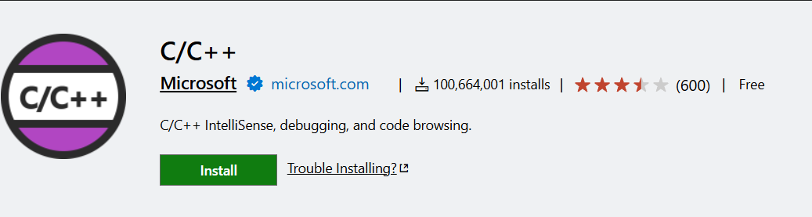

https://marketplace.visualstudio.com/items?itemName=ms-vscode.cpptools

Opcional:

## Error Lens
Para visualizar errores directamente en el editor.


https://marketplace.visualstudio.com/items?itemName=usernamehw.errorlens

---

# Paso 7 - Configurar para usar la terminal correcta en VSCode

vamos a [configurar](vscode://settings/terminal.integrated.profiles.windows) y pulsamos en el botón que indica la imagen:

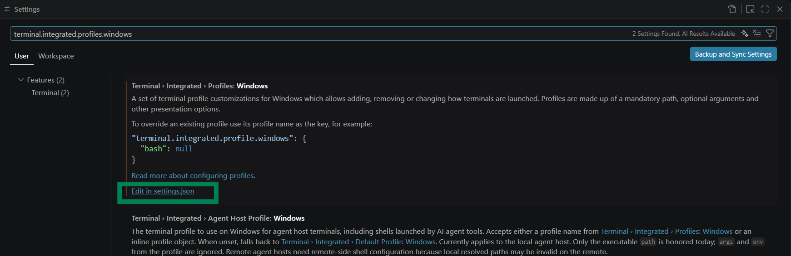

Ahí, añadimos al final el siguiente texto:

```JSON
"terminal.integrated.profiles.windows": {
    "MSYS2 MINGW64": {
        "path": "C:\\msys64\\usr\\bin\\bash.exe",
        "args": ["--login", "-i"],
        "env": {
            "MSYSTEM": "MINGW64",
            "CHERE_INVOKING": "1"
        }
    }
}
```

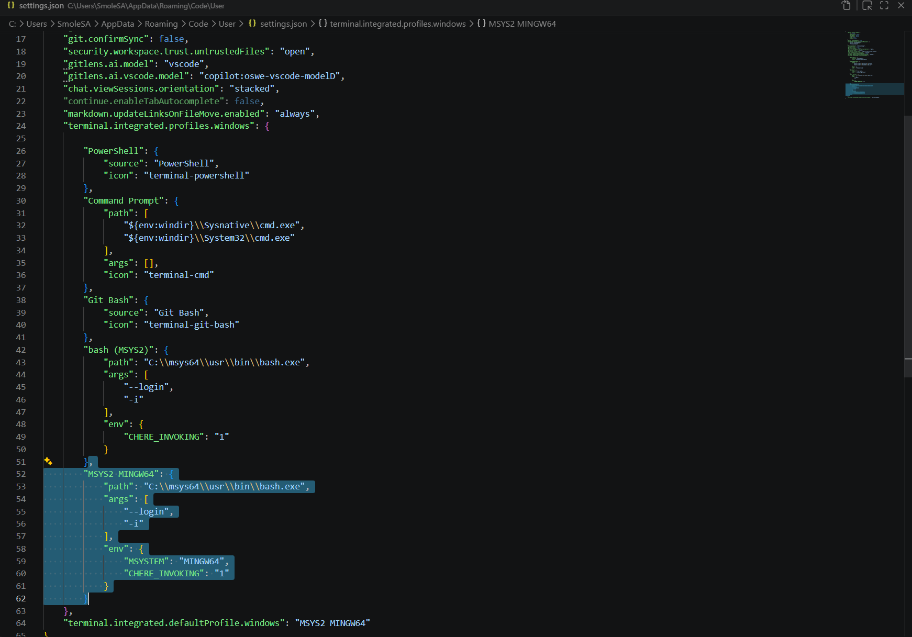

Modificamos el terminal por defecto:
```JSON
"MSYS2 MINGW64"
```

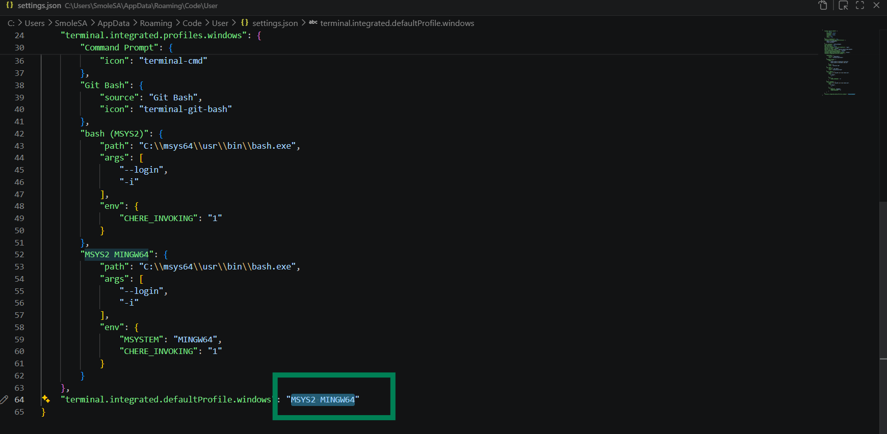

# Paso 8 — Compilar

## Con Make

Para compilar directamente usando Make, en un terminar (en la ruta del proyecto) escribimos:

```bash
make
```

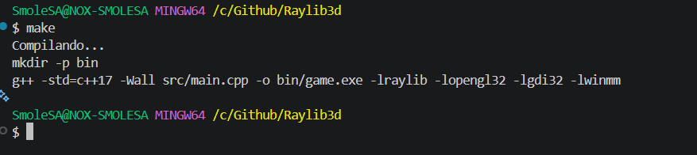

## Manualmente
Desde terminal :

```bash
g++ src/main.cpp -o game -lraylib -lopengl32 -lgdi32 -lwinmm
```

---

# Paso 9 — Ejecutar
## Con Make

```bash
make run
```

## Manualmente
Ejecutar:

```bash
./game.exe
```

Si todo ha ido bien, aparecerá una ventana con:

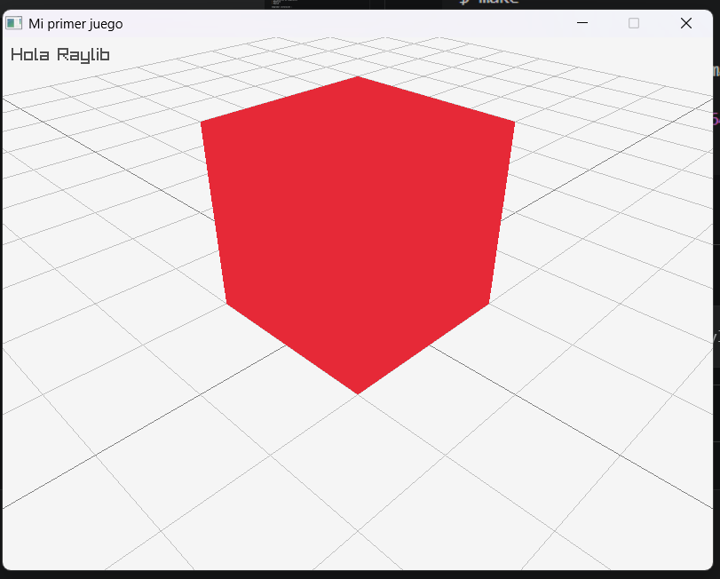

---

# Problemas comunes

## Error: g++ no reconocido

Causa:
- PATH incorrecto

Solución:
- Añadir:

```text
C:\msys64\ucrt64\bin
```

---

## Error: raylib.h not found

Causa:
- Raylib no instalado

Comprobar:

```bash
pacman -S mingw-w64-ucrt-x86_64-raylib
```

---

## Error al enlazar librerías

Comprobar flags:

```bash
-lraylib -lopengl32 -lgdi32 -lwinmm
```

---

# Entorno listo

Si todo funciona correctamente, ya se puede comenzar a desarrollar videojuegos 2D y 3D con:

- C++
- Raylib
- Visual Studio Code

# Regla importante del curso

Durante este curso:

- Usaremos siempre MINGW64
- Todo el código se compila con make
- No se usan comandos largos de g++