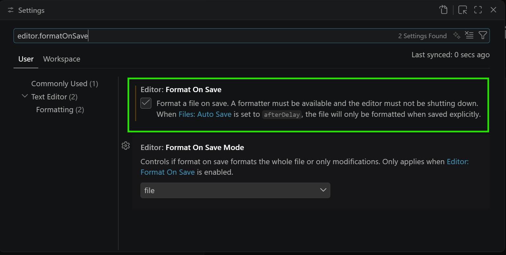

# configurar el autoformateo del archivo al guardar

```bash
editor.formatOnSave
```

[ir a "editor.formatOnSave"](vscode://settings/editor.formatOnSave)

Hay que dejar marcada la opción, tal y como se muestra en la imagen.


