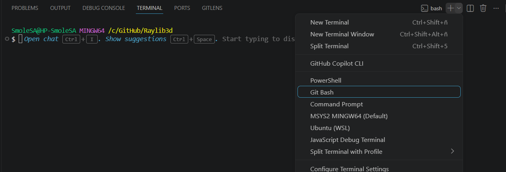
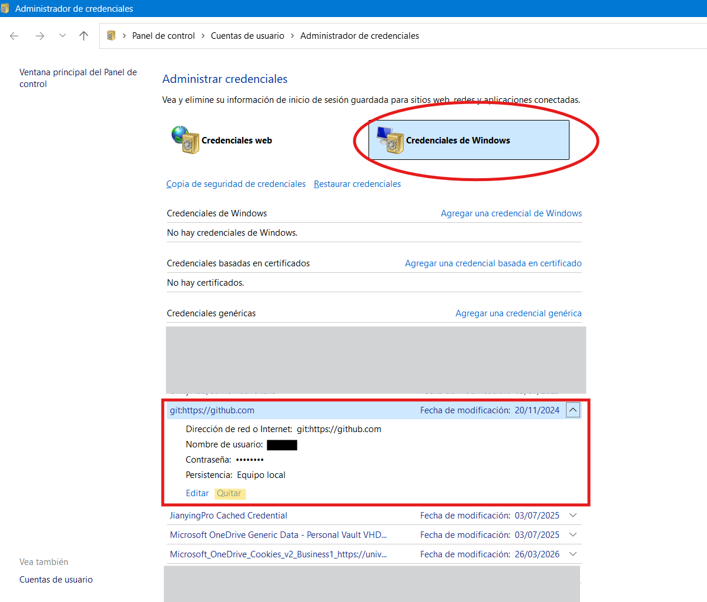

# corregir usuario git

Para cambiar el usuario del proyecto que tenemos abierto, en la terminal 'Git Bash', escribimos esto con nuestro nombre de usuario de Github y el correo.

## Abrir terminal




Y añadimos las siguientes lineas con nuestro usuario de Github y correo del mismo.

```bash
git config user.name "TuNombreDeUsuario"
git config user.email "tucorreo@ejemplo.com"
```

## OPCIONAL

Si no funcionara, podemos borrar los credenciales de windows buscando git. Y aplicar después [Abrir terminal](#abrir-terminal)

``` windows
Panel de control\Cuentas de usuario\Administrador de credenciales
```


