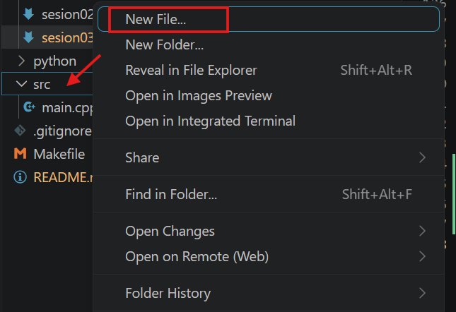

# Sesión 3 — Objeto clase y funciones

- [Sesión 3 — Objeto clase y funciones](#sesión-3--objeto-clase-y-funciones)
  - [Objetivos](#objetivos)
  - [Crear una clase jugador y definir su lógica](#crear-una-clase-jugador-y-definir-su-lógica)
    - [¿Que es una clase?](#que-es-una-clase)
      - [Componentes de una Clase](#componentes-de-una-clase)
        - [Niveles de Acceso (Encapsulamiento)](#niveles-de-acceso-encapsulamiento)
    - [Archivo de cabecera `hpp`](#archivo-de-cabecera-hpp)
    - [Archivo fuente `cpp`](#archivo-fuente-cpp)
    - [Funciones](#funciones)
  - [Trasladar la lógica de archivo `main.cpp` a los nuevos archivos](#trasladar-la-lógica-de-archivo-maincpp-a-los-nuevos-archivos)

## Objetivos

- Crear una clase jugador y definir su lógica

## Crear una clase jugador y definir su lógica

### ¿Que es una clase?

Una clase en C++ es una plantilla o "molde" definido por el programador que sirve para crear objetos. Es la herramienta fundamental de la Programación Orientada a Objetos (POO).

Imagínalo como el plano arquitectónico de una casa: el plano no es una casa real, pero define cuántas habitaciones tendrá y cómo se abrirán las puertas. Con ese mismo plano, puedes construir (instanciar) muchas casas reales.

#### Componentes de una Clase

Una clase agrupa dos elementos principales:

- **Atributos** (Variables): Son las características o propiedades del objeto (ej. la posición, la velocidad o la vida de un personaje).
- **Métodos** (Funciones): Son los comportamientos o acciones que el objeto puede realizar (ej. moverse, saltar o recibir daño).

##### Niveles de Acceso (Encapsulamiento)

Para proteger los datos y evitar que se modifiquen por error desde fuera de la clase, C++ utiliza tres modificadores de acceso:

- **private** (Privado): Todo lo que esté aquí solo puede ser visto o modificado por la propia clase. Por seguridad, los atributos siempre deben ser privados.
- **public** (Público): Todo lo que esté aquí puede ser usado desde cualquier otra parte del juego (como el archivo main.cpp). Por lo general, los métodos son públicos.
- **protected** (Protegido): Similar a privado, pero permite que las clases hijas (herencia) tengan acceso a esos datos

En C++ el código se divide en dos partes:

### Archivo de cabecera `hpp`

Archivos de cabecera (`.hpp`): Contienen el "qué" existe en el programa (declaraciones de funciones, clases, variables globales y estructuras).

Ejemplo de jugador:

```cpp
#pragma once // Evita problemas si el archivo se incluye varias veces

class Jugador {
private:
    // Atributos
    int vidas;

public:
    // Constructor de la clase (Crea una instancia de Jugador)
    Jugador(int vidasIniciales);
    // Desctructor (Libera recursos del sistema)
    ~Jugador();

    // Solo se declara la función, indicando qué recibe y qué devuelve
    void RecibirDanio(int cantidad); 
};
```

### Archivo fuente `cpp`

Archivos fuente (`.cpp`): Contienen el "cómo" funcionan las cosas (la implementación de las funciones, algoritmos y lógica).

Ejemplo de jugador:

```cpp
#include "jugador.hpp" // Es obligatorio incluir su propio archivo de cabecera

// Constructor: Rellenamos las variables del molde
Jugador::Jugador(int vidasIniciales){
    vidas = vidasIniciales;
}

// Aquí se programa el comportamiento de la función
void Jugador::RecibirDanio(int cantidad) {
    vidas -= cantidad;
    
    // Evitamos que las vidas tengan un valor negativo
    if (vidas < 0) {
        vidas = 0;
    }
}
```

En nuestro archivo `main.cpp` incluiriamos este nuevo archivo haciendo referencia al archivo de cabecera (`.hpp`), debajo de esto ( o de lineas similares):

<!-- embedme src/main.cpp#L1-L1 -->
```cpp
1 | #include "raylib.h"
```

Añadiriamos la referencia a nuestro archivo:

```cpp
#include "jugador.hpp" // 1. INCLUSIÓN OBLIGATORIA: Así el main conoce la existencia de la clase
```

quedando algo así:

```cpp
1 | #include "raylib.h"
y | #include "raymath.h"
x | #include "jugador.hpp" 
```

### Funciones

Una función es un bloque de código reutilizable que realiza una tarea específica dentro de un programa.

Para crear una función debes seguir una estructura de tres partes esenciales: el tipo de retorno, el nombre de la función y los parámetros entre paréntesis.

```cpp
tipo_de_retorno nombreDeLaFuncion(tipo_parametro1 nombreParametro1, tipo_parametro2 nombreParametro2) {
    // Aquí va el código que ejecuta la función
    return valor; // Solo si el tipo de retorno no es 'void'
}
```

```cpp
// Devuelve un número entero (int)
int CalcularDanioCritico(int danioBase) {
    int danioTotal = danioBase * 2; // Multiplica el daño por dos
    return danioTotal;              // Devuelve el resultado al juego
}
```

## Trasladar la lógica de archivo `main.cpp` a los nuevos archivos

Una vez entendido el concepto de clases y archivos, podemos trasladar toda la lógica asociada al jugador a un archivo.

1. Primero creamos un nuevo archivo con el nombre `Jugador.hpp` en la carpeta raiz `src/`.

2. Rellenamos el **archivo de cabecera**, `Jugador.hpp` como hemos visto anteriormente [¿Como rellenar el archivo de cabecera?](#archivo-de-cabecera-hpp).
3. Creamos un nuevo archivo con el nombre `Jugador.cpp` en la carpeta raiz `src/`.

4. Rellenamos el **arhivo de código fuente**, `Jugador.cpp` como hemos visto en [¿Como rellenar el archivo de código fuente?](#archivo-fuente-cpp)
